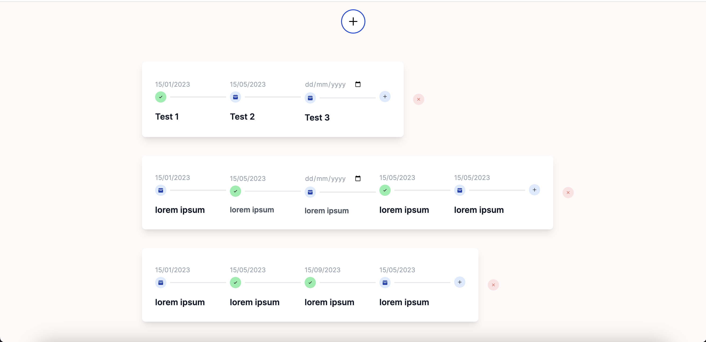

# Timeline Widget

This is a Next.js project bootstrapped with create-next-app. In this project you can create personalized timelines.

## Table of Contents

- [About](#about)
- [Technologies Used](#technologies-used)
- [Getting Started](#getting-started)
  - [Prerequisites](#prerequisites)
  - [Installation](#installation)
- [Usage](#usage)

## About

The purpuse of this project is to create personilized timelines. You can add multilple timelines widgets.Each timeline icludes: **Date**, **Check Point**, **Text Description** 

## Technologies Used

- Next.js
- React
- TypeScript
- Tailwind CSS
- Prisma
- MongoDB

### Prerequisites

These are the Prerequisites tools that need to be installed before running the project.

- Node.js
- npm or yarn
- MongoDB

### Getting Started

### Installation

A step-by-step guide on how to install and run the project:

1. Clone the repository:

    ```bash
    git clone https://github.com/Thanoskaloudis/timeline-widget.git
    ```
    ```bash
    cd timeline-widget
    npm install
    ```

2. Configure your environment variables. Create a .env file and set the necessary variables like your MongoDB connection string, API keys, etc.

3. Run the development server:

   ```bash
    npm run dev
    ```
    Your project should now be running on http://localhost:3000

### Usage

**Core Functionality**:
- add new points to the timeline
- edit the text associated with each existing point on the timeline.
- edit date for each existing point in the timeline
- when clicked, the point marked as complete or checked.
- delete timelines if you don't need them anymore.

Preview:
